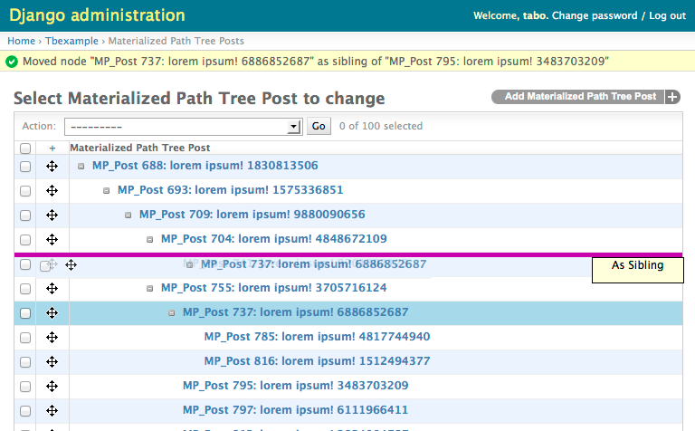

Admin
=====

API
---

.. module:: treebeard.admin

.. autoclass:: TreeAdmin
   :show-inheritance:

   Example:

   .. code-block:: python

        from django.contrib import admin
        from treebeard.admin import TreeAdmin
        from treebeard.forms import movenodeform_factory
        from myproject.models import MyNode

        class MyAdmin(TreeAdmin):
            form = movenodeform_factory(MyNode)

        admin.site.register(MyNode, MyAdmin)

.. autofunction:: admin_factory

Interface
---------

The ``TreeAdmin`` class provides a lazy-loaded, drag and drop interface
for working with trees. It efficiently loads the top level of the tree
and allows expanding nodes to reveal their children.

.. warning::

   ``TreeAdmin`` does not support ``list_editable`` fields, because of how the data is loaded. This parameter
   will be ignored if it is set.

Model Detail Pages
~~~~~~~~~~~~~~~~~~

If a model's field values are modified, then it is necessary to add the fields 'treebeard_position' and 'treebeard_ref_node_id'. Otherwise, it is not possible to create instances of the model.

Example:

   .. code-block:: python

        class MyAdmin(TreeAdmin):
            list_display = ('title', 'body', 'is_edited', 'timestamp', 'treebeard_position', 'treebeard_ref_node_id',)
            form = movenodeform_factory(MyNode)

        admin.site.register(MyNode, MyAdmin)

Foreign keys and One-to-one relationships
~~~~~~~~~~~~~~~~~~~~~~~~~~~~~~~~~~~~~~~~~

If your project contains models that have a foreign key or one-to-one relationship with a tree model,
you can leverage ``TreeNodeChoiceField`` to display the choices nicely in the Django admin. Given the following models:

    .. code-block:: python

        class TreeNode(MP_Node):
            ...

        class RelatedModel(models.Model):
            tree_node = models.ForeignKey("TreeNode")

You can configure the admin form for ``RelatedModel`` as follows for it to render the choices for ``tree_node`` in a nested list:

    .. code-block:: python

        class RelatedModelAdminForm(forms.ModelForm):
            tree_node = TreeNodeChoiceField(queryset=TreeNode.objects.all())

        class RelatedModelAdmin(admin.ModelAdmin):
            form = RelatedModelAdminForm

        admin.site.register(MyNode, MyAdmin)

.. warning::

   ``TreeNodeChoiceField`` should not be used with AL nodes, because they cannot be queried efficiently
   in this context.